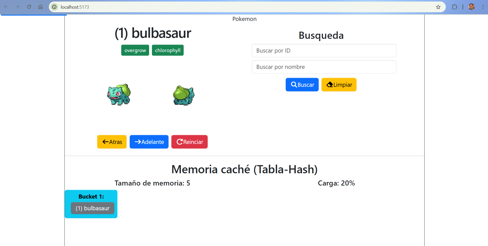

# Examen parcial-1

Que el alumno analice, corrija y extienda un componente React que consume una API externa, aplicando correctamente principios de:

- Tablas hash
- Memoria caché
- Manejo de colisiones
- Factor de carga y rehashing
- Integración entre estructuras de datos y componentes React

Al finalizar la actividad, el alumno será capaz de utilizar una tabla hash como memoria caché real, evitando solicitudes innecesarias a la API y mostrando de forma explícita el origen de los datos.
